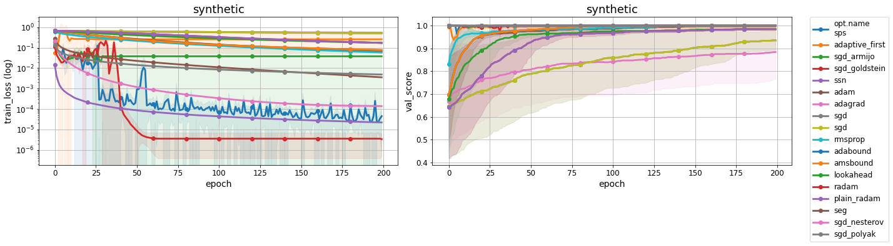
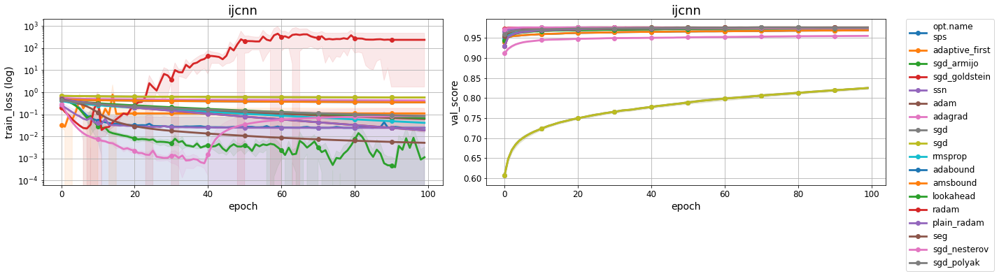
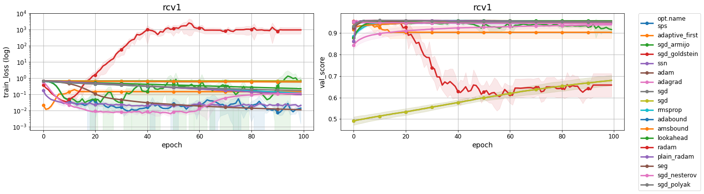
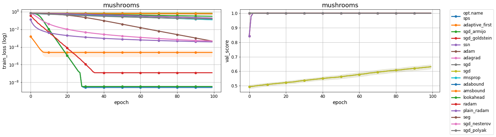
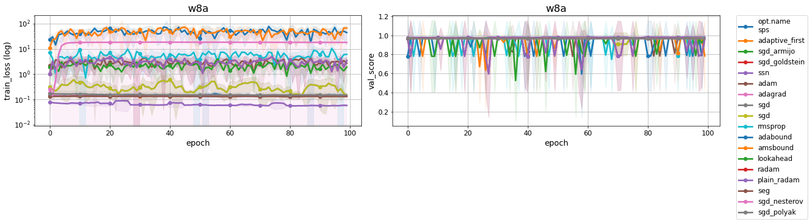
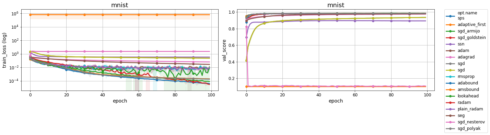
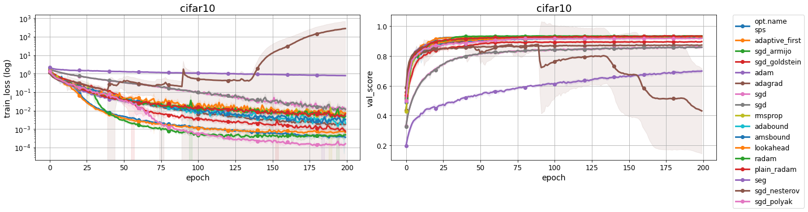

# Awesome Optimization Benchmark

The goal of this repository is 
  - to illustrate how different optimizers perform on different datasets using a standard benchmark; and 
  - allow users to add their own datasets and optimizers to have a reliable comparison and inspire new state-of-the-art optimizers for different machine learning problem setups.

## Contents

- Quick Start
- Adding new benchmarks
- Optimizers Implemented
- Leaderboard


## Quick Start 


**Install requirements**
`pip install -r requirements.txt` 


**To run the experiments and get the validation results locally:**

```python
python trainval.py -e <expconfig> -r "0" -d <datadir> -sb <savedir_base> -nw "0" -j "0"

<expconfig>             Name definition of the experiment experiment configuration
<datadir>               Path to the saved data directory
<savedir_base>          Path to the saved results directory
```


**To run the experiments and get the validationn results in slurm:**
```
python trainval.py -e <expconfig> -r "0" -d <datadir> -sb <savedir_base> -nw "0" -j "slurm"

<expconfig>             Name definition of the experiment experiment configuration
<datadir>               Path to the saved data directory
<savedir_base>          Path to the saved results directory
```


**To view the results :**

Example
```
python trainval.py -e <expconfig> -v 1 -d <datadir> -sb <savedir_base>

<expconfig>             Name definition of the experiment experiment configuration
<datadir>               Path to the saved data directory
<savedir_base>          Path to the saved results directory
```

## Adding a new benchmark

**Add an optimizer**

1. Define a new optimizer in `src/optimizers/<new_optimizer>.py`.
2. Init the constructor for `opt_name = "<new_optimizer>"` in `src/optimizers/__init__.py`.

For example,
```
elif opt_name == "seg":
        opt = sls_eg.SlsEg(params, n_batches_per_epoch=n_batches_per_epoch)
```

**Add a dataset**

Define a new dataset and its according transformations in `src/datasets/__init__.py` for `dataset_name = "<new_dataset>"`.

For example,
```
   if dataset_name == "mnist":
        view = torchvision.transforms.Lambda(lambda x: x.view(-1).view(784))
        dataset = torchvision.datasets.MNIST(datadir, train=train_flag,
                               download=True,
                               transform=torchvision.transforms.Compose([
                                   torchvision.transforms.ToTensor(),
                                   torchvision.transforms.Normalize(
                                       (0.5,), (0.5,)),
                                   view
                               ])
                               )
```

**Add a model**

1. Define the matrics, loss functionn, and the accuracy function in the `src/models/classifiers.py`
2. Define the base model in the `get_classifier(clf_name, train_set)` function in `src/models/base_classifiers.py`.


**Run the new benchmark**

Define the experiment configuration you would like to run. The dataset, models, optimizers, and hyperparameters can all be defined in the experiment configurations.
```
EXP_GROUPS['new_benchmark'] = {"dataset": [<dataset_name>],
                     "model_base": [<network_name>],
                     "opt": [<optimizer_dict>],}
```

Train using the following command
```
python trainval.py -e new_benchmark -v 1 -d ../results -sb ../results
```

### Optimizers Implemented 

| Name | Conference/Journal | Implemented   | 
| ---- |  ----- | ----- | 
| Adam| [ICLR2015](https://arxiv.org/pdf/1412.6980.pdf)  | [Yes (opt=adam)](https://github.com/haven-ai/optimization-benchmark/blob/main/src/optimizers/__init__.py) |

* adaptive_first [paper]()

* SGD with Armijo line search [Minimization of functions having Lipschitz continuous first partial derivatives](https://msp.org/pjm/1966/16-1/p01.xhtml)

* SGD with Goldstein [Cauchy's method of minimization](https://idp.springer.com/authorize/casa?redirect_uri=https://link.springer.com/article/10.1007/BF01386306&casa_token=fJPrXJ0xVwIAAAAA:rFFa9IMPl50d2j7xqq3MVrA-L92-O1gdSnlEElXZ7PxnWQYaZQ0LsAWjqjs4TmJb0nHhiNPf1KgVxRhTUw)

* sgd_nesterov [A method for solving the convex programming problem with convergence rate O(1/k^2)](https://ci.nii.ac.jp/naid/10029946121/)

* sgd_polyak [Gradient methods for minimizing functionals](https://www.researchgate.net/publication/243648552_Gradient_methods_for_the_minimisation_of_functionals)

* adam [paper](https://arxiv.org/pdf/1412.6980.pdf)

* adagrad [Adaptive Subgradient Methods for Online Learning and Stochastic Optimization](https://www.jmlr.org/papers/volume12/duchi11a/duchi11a.pdf)

* ssn [Fast and Furious Convergence:
Stochastic Second-Order Methods under Interpolation](https://arxiv.org/pdf/1910.04920.pdf)

* seg [paper]()

* sgd [Stochastic Estimation of the Maximum of a Regression Function](https://projecteuclid.org/journals/annals-of-mathematical-statistics/volume-23/issue-3/Stochastic-Estimation-of-the-Maximum-of-a-Regression-Function/10.1214/aoms/1177729392.full)


* rmsprop [Generating Sequences With Recurrent Neural Networks](https://arxiv.org/pdf/1308.0850.pdf)

* adabound [Adaptive Gradient Methods with Dynamic Bound of Learning Rate](https://openreview.net/forum?id=Bkg3g2R9FX)

* amsbound [Adaptive Gradient Methods with Dynamic Bound of Learning Rate](https://openreview.net/forum?id=Bkg3g2R9FX)

* sps [Stochastic Polyak Step-size for SGD:
An Adaptive Learning Rate for Fast Convergence](https://arxiv.org/pdf/2002.10542.pdf)

* lookahead [Lookahead Optimizer: k steps forward, 1 step back](https://arxiv.org/abs/1907.08610)

* radam [On the Variance of the Adaptive Learning Rate and Beyond](https://arxiv.org/abs/1908.03265)


## Leaderboard
The section is being continually updated with the latest optimizers on standard benchmarks.

### synthetic


### ijcnn


### rcv1


### mushrooms


### w8a


### MNIST - MLP


### CIFAR10 - ResNet34


### CIFAR100 - ResNet34


